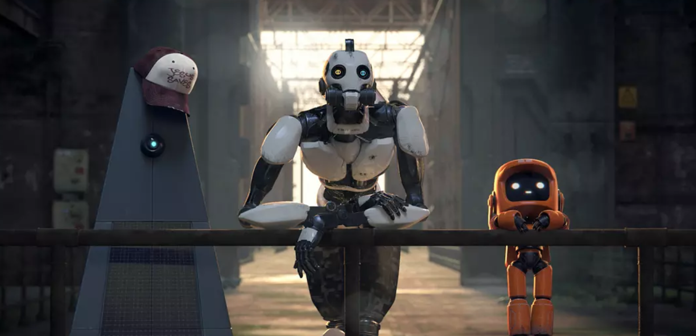

# 见闻05 - 掉入地下一万米

> 记录每周所见所闻，优质高质量文章推荐，重大新闻事件，以及好书推荐

## 一. 好文推荐

1. [京东被大学生诈骗110万元](https://mp.weixin.qq.com/s/K7aF3wUtiHvlsl8wMQOj-Q)
> 现在想利用漏洞犯罪可不件容易的事，现在用户信息早就没有隐私了，想定位还是很容易的

2. [掉入地下一万米](https://mp.weixin.qq.com/s/vbYXorBfXExzpYuqViVeJg)

3. [吴军：媒体不知道的那些硅谷“阴暗”的东西](https://mp.weixin.qq.com/s/rYVNEqz4MFKQfbOAcICyLw)
> 目前Google无人自动驾驶汽车做到什么水平了？ 基本上是大概行驶10000公里，需要人为干预一次。苹果是每行驶4公理干预一次，Uber的什么水平？一公里就要干预一次。
> 商业的本质是什么？**商业的本质是让每一个人多花钱，而不是省钱。**

4. [借鉴美日：经济下行时，什么行业还在赚钱？](https://mp.weixin.qq.com/s/T6FasBHZwL3F9N17yijf_A)
> 所有行业里，只有教育和健康行业，是几乎完全不受经济环境影响的长青行业。
> 很多人把价值，理解成“上一次购买的价格”。不是的，价值是“未来的价格”

## 二. 事件

1. 苹果发布第三代iPad air ，第5代iPad mini，第二代AirPods，以及上新iMac。
> 可惜第三代iPad air ，第5代iPad mini只支持第一代手写笔pencil

2. 山东省公安厅：成立专案组调查专升本考试疑似泄题事件。
> 山东省泄漏题目以及不是一次两次了。

3. 特斯拉中国官网公布Model Y预估价格：43.5万起。

4. 工信部：禁止擅自对“携号转网”增设办理条件.
> “携号转网”就是号码不变，可以换移动运营商，比如移动的号码，换成联通的，号码不变。

## 三. 散记

1. 业内人士透露：遇到保险相关的麻烦，打12378 很好用，不管有理没理，都会赔偿

2. 《爱、死亡和机器人》是一部动画短片豆瓣9.3分，涵盖多种类型，包括科幻、奇幻、恐怖和喜剧；这些短片也将包含多种形式，包括传统2D和3DCGI短片。

3. 至今没有任何一种中药或者中成药能通过FDA的审查，细思极恐。
> FDA是美国食品和药物管理局(Food and Drug Administration)的简称，是160余个WTO成员国通用的标准，通过了FDA认可，才能进行商业化临床应用。FDA也是国际上认可国家最多的标准。
