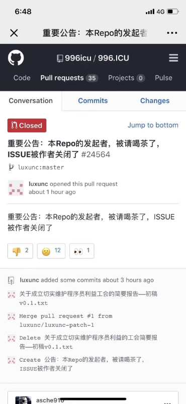
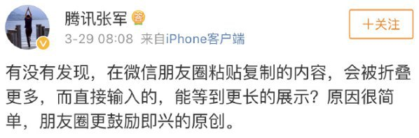
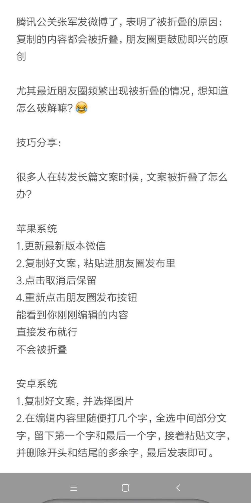

# 见闻06 - 为什么有时候发朋友圈文字会被折叠  

> 记录每周所见所闻，优质高质量文章推荐，重大新闻事件，以及好书推荐

## 一. 好文推荐

1. [上亿简历大数据公司被警方一锅端，李开复、中信资本均投资](https://mp.weixin.qq.com/s/mvVx3bxy6xnUNa5_FeKoaQ?from=groupmessage&isappinstalled=0)
> 巧达数据号称拥有中国最大的简历数据库

2. [苹果发布 4 大新品：真的好软！](https://mp.weixin.qq.com/s/A_Vkm6PxdpUcfalISElm1Q)
>其中，Apple News+的主要特点是合作媒体数量庞大（包括著名的华尔街日报等）且足够专业，而且内容封面和插图可以以动态的形式呈现。

3. [实锤，团贷网暴雷....](https://mp.weixin.qq.com/s/85QnghV65vJYDHbUJbfT7w)
>P2P网贷行业的清理整顿完成时间至2019年6月，所以尽量不要再投p2p理财了，如果已经投了，赶紧取出来吧

4. [996.ICU ,程序员群体用自己的方式表达不满](https://mp.weixin.qq.com/s/Vkt9TztTBDjLvc7aRNav7w)
> 你懂的，

5. [996.ICU项目地址](https://github.com/996icu/996.ICU)
> 几天时间已经有十几万人点赞，所谓“996”工作制，即每天早 9 点到岗，一直工作到晚上 9 点。每周工作 6 天。“996”工作制的周工作时间为最低 60 小时。

6. [996.ICU](https://996.icu/#/zh_CN)
> 什么是 996.ICU？工作 996，生病 ICU。

## 二. 事件

1. 根据 AMC 官方和 IMDb 消息，《复仇者联盟4：终局之战》整片时长为 182 分钟（3 小时 2 分钟），为漫威 MCU 电影史上时长最长的一部电影，想想一下在电影院连续看3小时是什么情况？[捂脸]

2. 《复仇者联盟4：终局之战》终于定档于4月24

3. 你不知道的朋友圈秘密,为什么有时候发朋友圈文字会被折叠
> 

4. 那么怎么发送，才不会折叠，小技巧
> 

