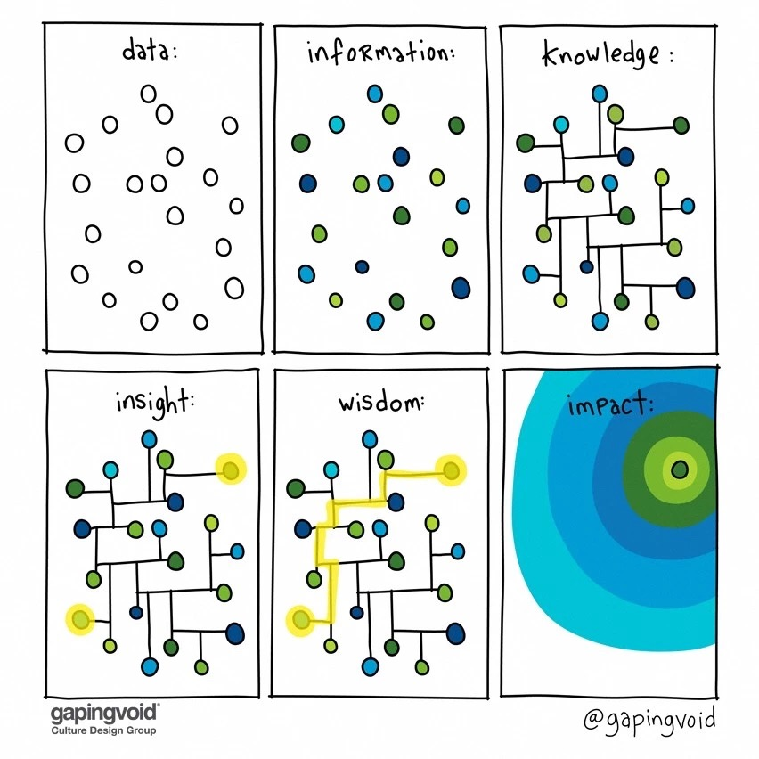

# 见闻07 - 年轻人将来有大出息的一些兆头

> 记录每周所见所闻，优质高质量文章推荐，以及好书推荐

## 一. 好文推荐

1.[年轻人将来有大出息的一些兆头](https://mp.weixin.qq.com/s/kB3y2KjEUkNCkeMT-AjSGA)

> 在很小的时候就有异常独立的价值观，有强烈的获胜欲望。这说的不就是火影忍者的鸣人吗？

2.[马云谈996](https://mp.weixin.qq.com/s/oc0NugBjpsn1_mBtbib2Lg)

>嗯，真香警告

3.[996的本质是在掠夺其他人的就业机会](https://mp.weixin.qq.com/s/GqOBfwc_T4Dcv65Lgu4iMg)

>什么是福报？

>最好的福报。无非是每天从家里温暖的床上醒来，有份力所能及和自己喜欢的事做，每天有充足的睡眠，个人及和家人共处的时间。人要对自己负责，把青春花在自己的身上，而不是成为别人的燃料。趁现在还早。没有任何人或组织，能替代你绽放你鲜活的生命。

4.[这张图，建议每个人保存](https://mp.weixin.qq.com/s/gJv2jjl1GDwbNSKiHg7c_w)

5.[读书其实没有什么用](https://mp.weixin.qq.com/s/1P_Iw3D6SbJEeApVmekS6A)

> 一百本书就是一百个世界啊，赚钱是很重要，可一个丰富的精神世界也很重要啊！

> 读书，可以让你成为一个更好的人。读书没有什么用，但这世界上的一切并不是都以“有用”去衡量。

6.[刘强东案音视频：机构媒体的堕落与溃败](https://mp.weixin.qq.com/s/EEj0Hrp3Tq6BFF5EAPWG-Q)

7.[Teach Yourself Programming in Ten Years](https://liuyandong.com/2017/10/25/122/)

> 值得注意的是，在大多数领域，即使你是个天才，要达到专家级别的高水平仍然需要时间。10，000个小时只是给你一个概念，一个天才，如果每周练习10到20个小时的时间，仍然需要数年时间才能达到专家级别的水平

## 二. 散记

1.一开始就拒绝，比最后反悔要容易。 ——达芬奇

2.刚去楼下商店买包19块钱的黄鹤楼，回到楼上点了烟吸了两口，突然翻到这篇文章就狠狠把手里的烟踩了，一个转身再去商店买了包中华。不是我膨胀，是我觉得19块钱的黄鹤楼配不上这篇文章

3.我们不是为了把车卖给富人，而是为了改变汽车的本质。

4.我们在生活和工作中，会遇到各种各样的数据。数据经过处理和加工，变成了信息。信息之间产生了联系，形成了知识。通过现有知识，发现了一些知识之间的新关系，于是形成了洞见。把一系列洞见串联起来，形成了智慧。向外传播智慧，形成了影响力。
> 

5.大多数人都高估了自己一年内能做到的事情，也低估了自己十年内做到的事情  -吉姆.罗恩

6.罗振宇老师在跨年演讲中引用了我的一句话：在中国再众所周知的事情，都有一个亿的人不知道，但往往是十个亿的人都不知道。

